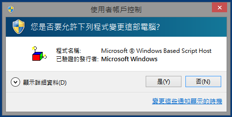

NTHU KMS Activation Script
==========================

It is an all-in-one KMS activation script for NTHU users.

Usage
-----
Directly download nthu-kms.vbs and double click to execute.

<https://raw.github.com/lyshie/nthu-kms/master/nthu-kms.vbs>

Convert to Big5 encoding
------------------------
    # ./to_big5.sh

Screenshots
-----------
* Desktop icon

    

* User Account Control

    

* SSL-VPN

    

* Windows Activation

    

* Office Activation

    

Author
------
    SHIE, Li-Yi <lyshie@mx.nthu.edu.tw>

License
-------
    GNU General Public License (GPL)
